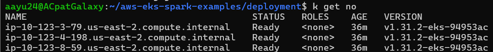

## EKS Setup
1. Install terraform. Steps mentioned [here](deployment/INSTALL.md)
2. Setup AWS CLI.
3. Navigate to deployment/aws-eks folder and generate the terraform plan file.
```bash
tf plan -out tfplan
```
4. Once plan is generated, apply the plan to create the EKS cluster.
```bash
tf apply tfplan
```
5. Once apply is done, you should get a cluster with 3 worker nodes.



## Submit Spark ETL App on EKS cluster
1. We will use the [spark-operator](https://github.com/kubeflow/spark-operator) helm chart for setting up spark on the cluster.

2. Before we do that, there are some prerequisites.

3. Setup the rbac roles for spark app to allow driver to access the pods resources and communicate with executors.
```bash
kubectl apply -f spark-rbac.yaml
```

4. For allowing spark app to connect to AWS S3 bucket, we will be sharing the Access Key and Secret Key via ENV variables to 
the driver and executor pods.

5. Run the below command to configure kubernetes secret for storing the `AWS_SECRET_ACCESS_KEY` and `AWS_ACCESS_KEY_ID`.
```bash
kubectl create secret generic aws-secrets --from-file=<access-key-file> --from-file=<secret-key-file>
```

6. With the rbac and secret setup complete, we can move on setting up the spark app.  

7. Run the following commands to add helm repo and install the helm chart.
```bash
# Add the Helm repository
helm repo add spark-operator https://kubeflow.github.io/spark-operator
helm repo update

# Install the operator into the default namespace and wait for deployments to be ready
helm install spark-operator spark-operator/spark-operator
```

8. Once chart is installed, navigate to the deployment folder and run the following command to submit the ETL spark app to cluster.
```bash
kubectl apply -f spark-job.yaml
```

9. This will run the spark app script specified under spec.mainApplicationFile in spark-job.yaml on EKS cluster.

## Jupyter Notebook Setup For Interactive Querying
1. Spin up jupyter notebook in a separate pod. Note that this assumes we have setup the rbac and secrets.
```bash
kubectl apply -f jupyter.yaml
```

2. To be able to view the notebooks locally at port localhost:8888, use port forwarding.
```bash
kubectl port-forward <jupyter-pod-name> 8888:8888
```

3. For fetching the token, look into the logs of the jupyter pod. It is the string after token= .
```bash
kubectl logs <jupyter-pod-name>
```

```log
[I 2024-12-03 05:44:47.833 ServerApp] Serving notebooks from local directory: /opt/spark/work-dir
[I 2024-12-03 05:44:47.833 ServerApp] Jupyter Server 2.14.2 is running at:
[I 2024-12-03 05:44:47.833 ServerApp] http://jupyter-5ddf4754b5-vktbq:8888/tree?token=3e9b957692a522e7b2c74f46d312244873e185a0f7abfe09
[I 2024-12-03 05:44:47.833 ServerApp]     http://127.0.0.1:8888/tree?token=3e9b957692a522e7b2c74f46d312244873e185a0f7abfe09
[I 2024-12-03 05:44:47.833 ServerApp] Use Control-C to stop this server and shut down all kernels (twice to skip confirmation).
[C 2024-12-03 05:44:47.837 ServerApp]

    To access the server, open this file in a browser:
        file:///root/.local/share/jupyter/runtime/jpserver-7-open.html
    Or copy and paste one of these URLs:
        http://jupyter-5ddf4754b5-vktbq:8888/tree?token=3e9b957692a522e7b2c74f46d312244873e185a0f7abfe09
        http://127.0.0.1:8888/tree?token=3e9b957692a522e7b2c74f46d312244873e185a0f7abfe09
```

4. Start a new notebook with Python3 kernel, and create spark session in that notebook. You can refer to [sample_query_eks.ipynb](./sample_query_eks.ipynb).

5. Once spark session is ready, to be able to view the Spark Web UI locally at localhost:4040, use port forwarding.
```bash
kubectl port-forward <jupyter-pod-name> 4040:4040
```